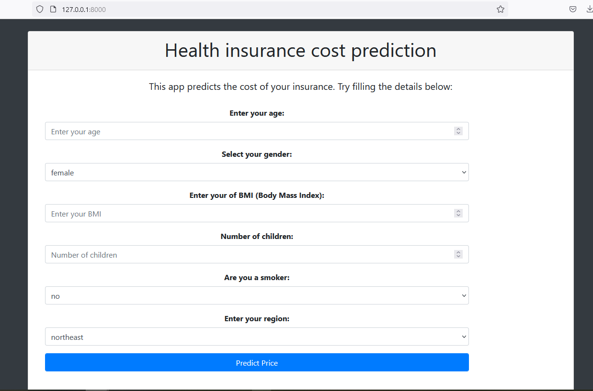

# Health Insurance Cost Predictor

## Aim
This project aims to predict a person's health insurance cost per year. It takes the age, gender, BMI, number of chilfren and other parameters as shown in the picture below.

## How to use
- Clone the repository 

- Install the required packages in "requirements.txt" file by running: *pip install -r requirements.txt*

- Run the "app.py" file using the command  *uvicorn app:app --reload* and the App is ready to be browsed on your localhost.

## Description

### What this App does?
This app takes the parameters of a person including age, sex, BMI, number of children, whether the person is a smoker and the region. It then predicts the person's potential health insurance costs. The following illustration shows an example of a prediction.

### How this Project has been realized?
- First, the data were collected from Kaggle (https://www.kaggle.com/datasets/mirichoi0218/insurance?resource=download).

- Then, they were analysed and cleaned. 

- Before the training a "One Hot Encoding" has been applied to transform categorical features.

- The data were then trained using the  LinearRegression, SVR,RandomForestRegressor and GradientBoostingRegressor models.

- The performances of the these models have been evaluated and compared. As a result, the GradientBoostingRegressor model performed the best with a score of 90%.

- Link for notebook:  [Insurance cost prediction](https://github.com/DanielleOriane/Machine_Learning_project/blob/main/insurance_cost_prediction.ipynb)

- This project was given the form of an website built on FastAPI (See [app.py](https://github.com/DanielleOriane/Machine_Learning_project/blob/main/app.py) file) where the trained model has been used to perform the predictions.

